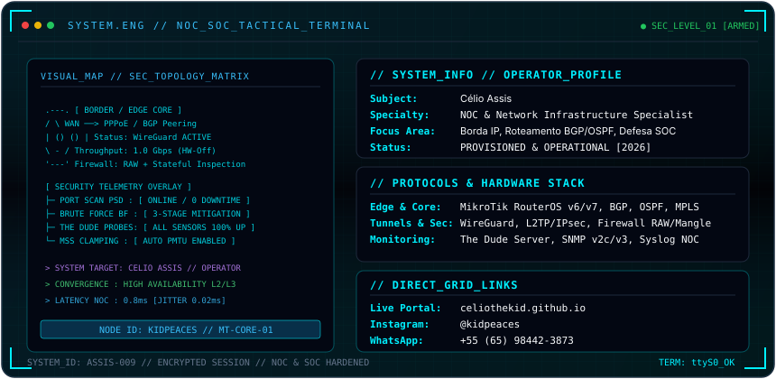

<div align="center">

  

<br/>

<p align="center">
  <a href="https://celiothekid.github.io" target="_blank"></a>
  <a href="https://wa.me/5565984423873" target="_blank"></a>
  <a href="https://instagram.com/kidpeaces/" target="_blank"></a>
</p>

</div>

---

### 🛠️ Matriz de Operações & Roteamento

```text
 [ BORDA & ROTEAMENTO ] ─────> BGP Peering, RouterOS v6/v7, OSPF Multi-Area, Failover Recursivo
 [ CRIPTOGRAFIA & VPN ] ─────> WireGuard Protocol, IKEv2 / IPsec Suite, L2TP, MSS Clamping
 [ DEFESA ATIVA & SOC ] ─────> Filtro RAW Anti-DDoS, Mitigação Brute-Force 3 Estágios, Drop Scans
 [ TELEMETRIA & NOC ]   ─────> The Dude Server, SNMP v2c/v3, Syslog Centralizado, Auto-Health Check
